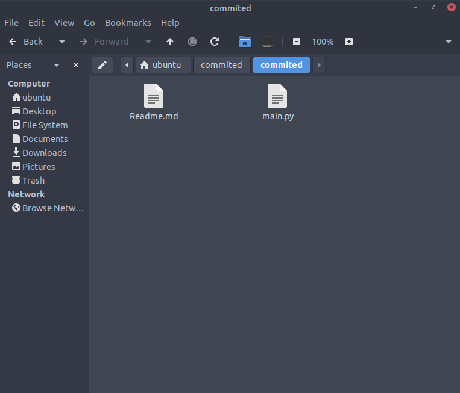
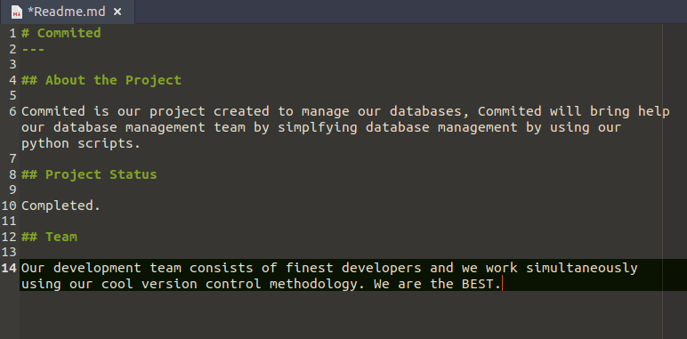
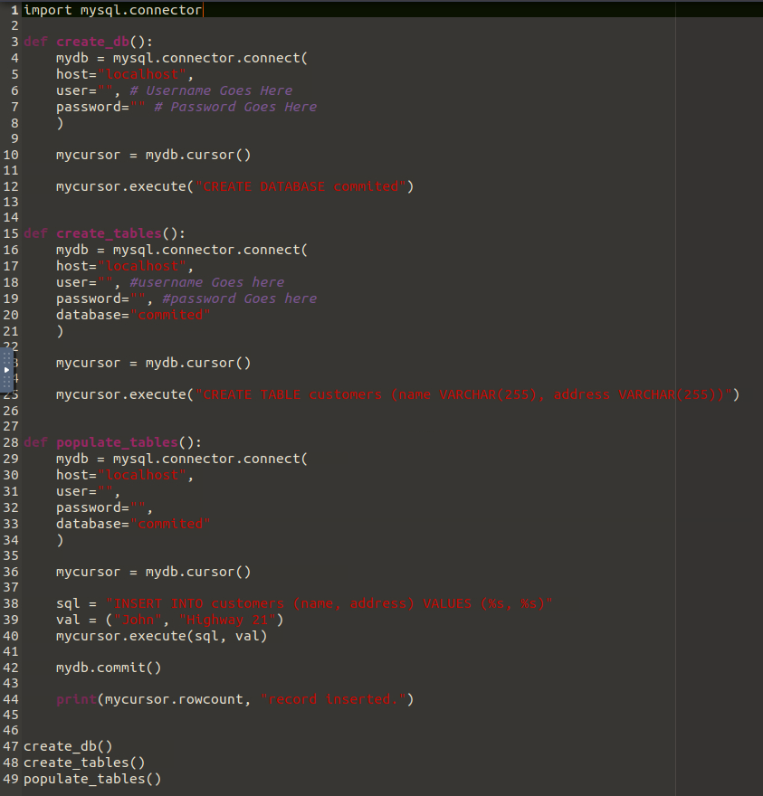
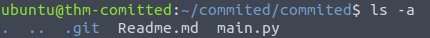
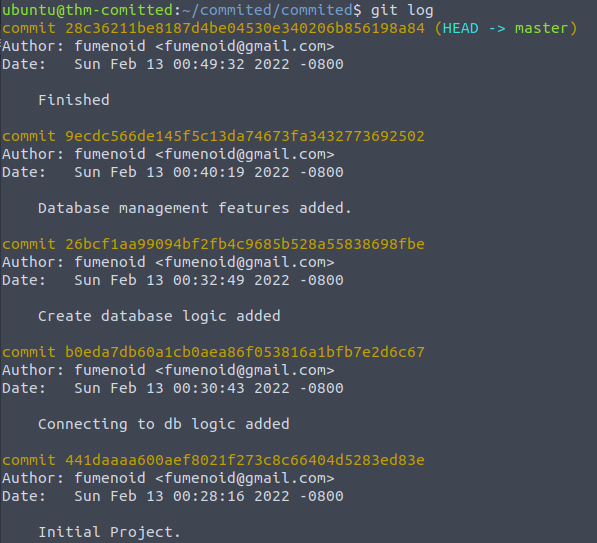
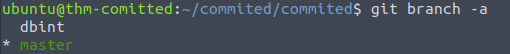
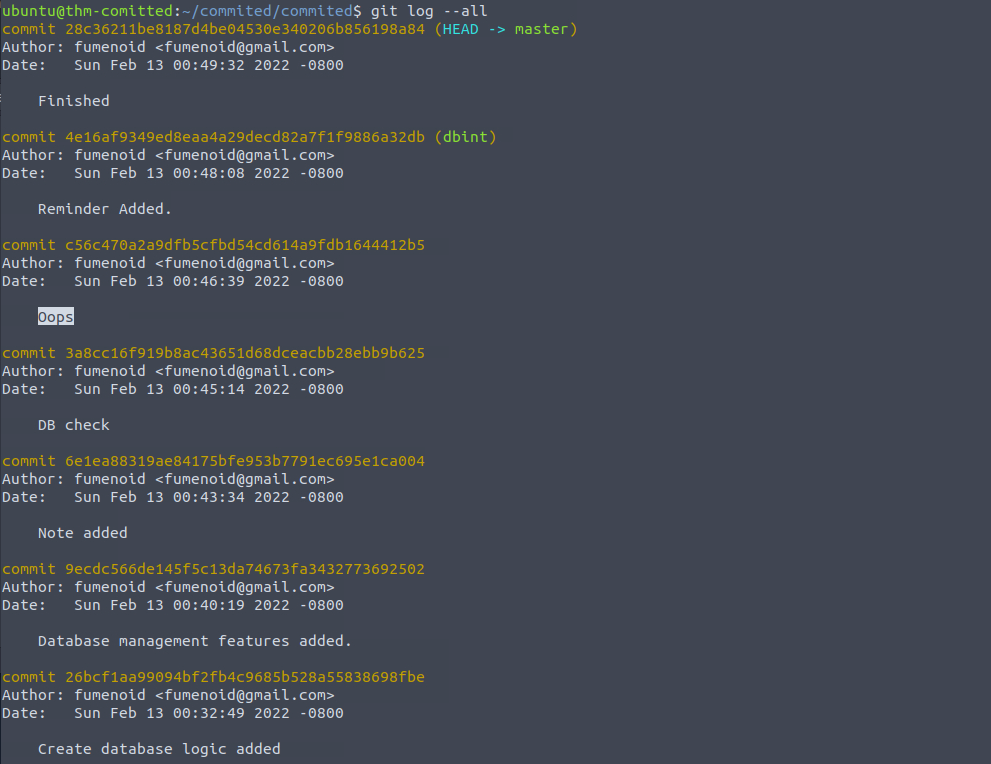
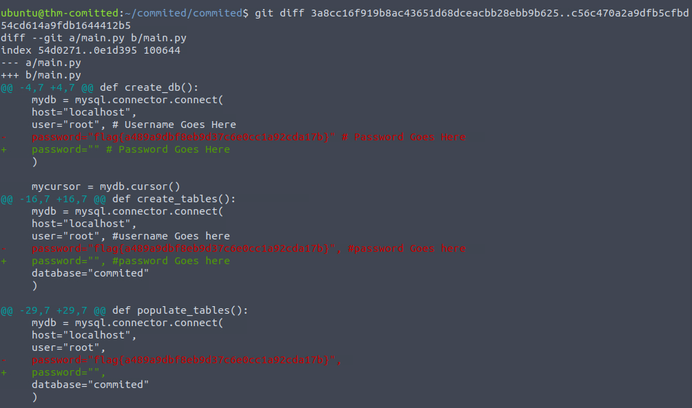

# Introduction
- **Link**: https://tryhackme.com/room/committed
- **Room Type**: Premium
- **Theme**: git
# Walkthrough
- After extracting the zip file, we get a folder containing 2 files: `Readme.md` and `main.py`

- The content of both these files seems to be normal:

- From the context of the room, we know that this is a git repo. We check if there's a `.git` folder: `ls -a`

- We've confirmed that it is a git repo. We'll now use git commands to investigate. `git log` shows nothing wrong:

- Let's see if there are multiple branches: `git branch -a`

- We'll use `git log --all` to have an complete view of the log. We found a commit that says "Oops", which is very suspicious.

- Now we use `git diff A..B` to see what changed in that commit:

- And we've found the flag! Which was a password written as plaintext into the code, a huge mistake for security.
# Solution
`flag{a489a9dbf8eb9d37c6e0cc1a92cda17b}`
