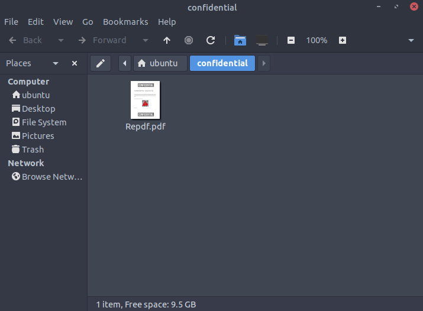
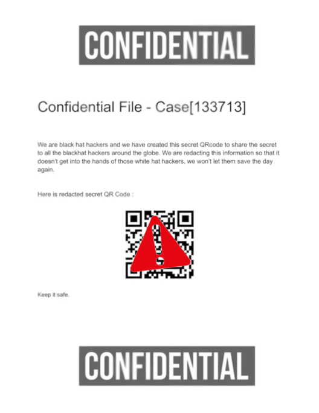
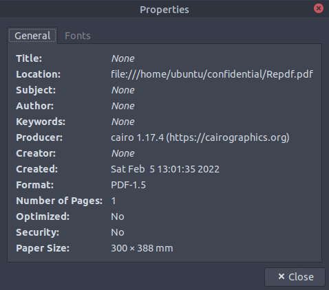
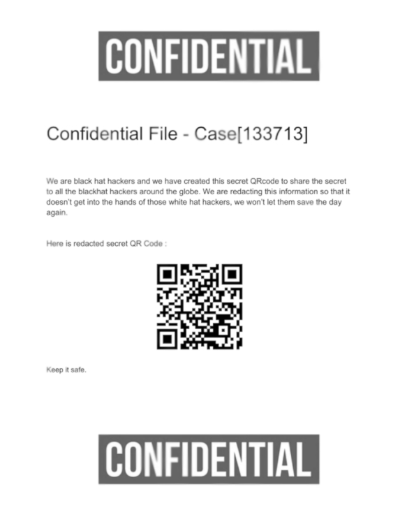

# Introduction
- **Link**: https://tryhackme.com/room/confidential
- **Room Type**: Premium
- **Theme**: DF, .pdf, QR-code
# Walkthrough
- We only have one file that we have to investigate:

- After openning the file, we see that the QR-code is covered by a small image:

- Checking the properties of the file, we found one interesting information: `Producer: cairo 1.17.4 (https://cairographics.org)`

- A quick internet search tells us that **cairo** is a graphic library used for drawing, which can apply a png image on top of a surface (e.g. a pdf file).
- The red image in the pdf clearly has a different resolution than the background, so it must be added by **cairo** on top of the original pdf file.
- With our newfound knowledge, we can try extracting only the the image containing the QR-code to bypass the censoring.
- `Right-click anywhere outside the red censoring image > Save Image As... > qr.png`

- We got the QR-code! Now we just have to scan it with a phone or by uploading it to an online QR-scanner.
- I don't want to type the answer from my phone or go to a random website so I made [my own QR-decoder](https://github.com/wundunii/qr-decoder)
# Solution
`flag{e08e6ce2f077a1b420cfd4a5d1a57a8d}`
