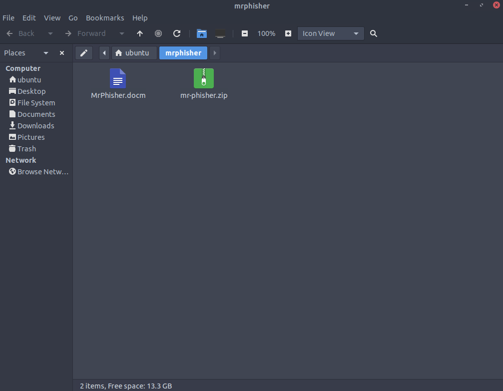
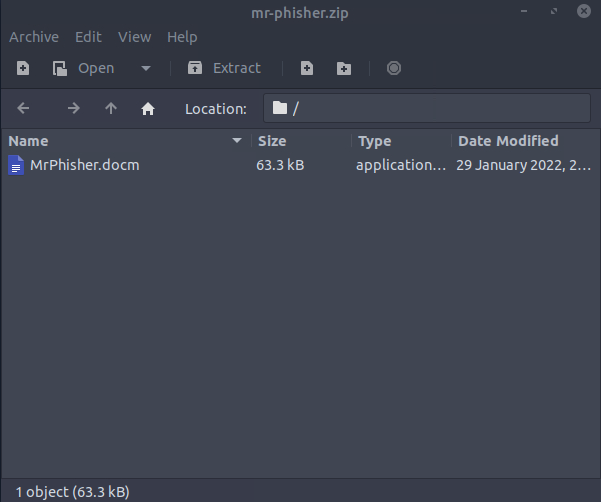
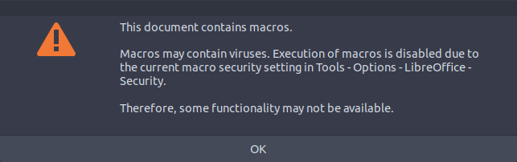
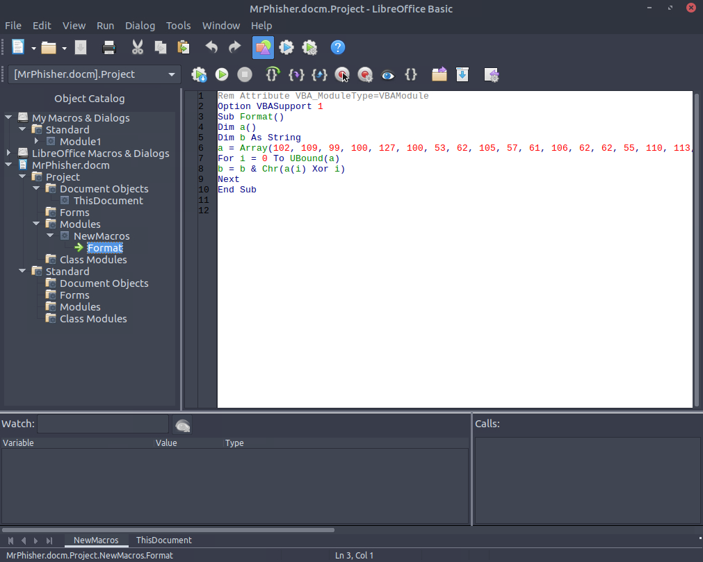
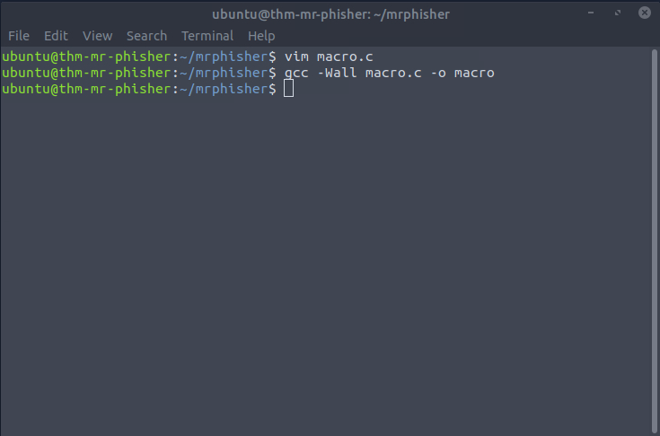
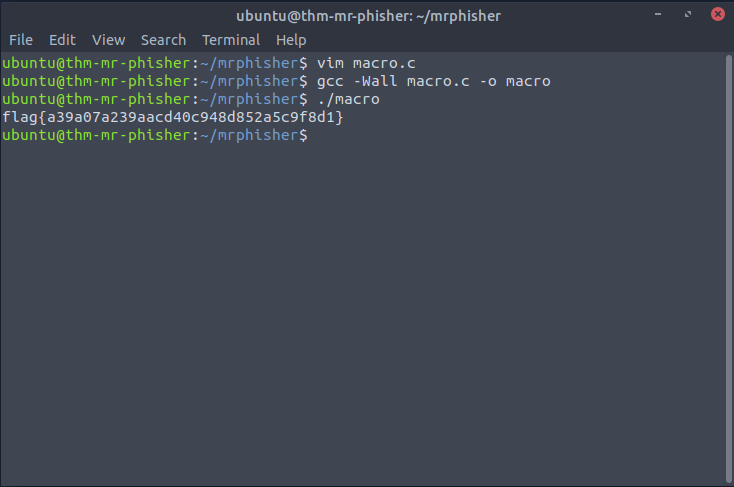

# Introduction
- **Link**: https://tryhackme.com/room/mrphisher
- **Room Type**: Premium
- **Theme**: Phishing, .doc, macros
# Walkthrough
- We are welcomed with two files that we have to investigate:


- Inside `mr.phisher.zip` we find the same `MrPhisher.docm` file that was already extracted in the same folder:


- Openning `MrPhisher.docm` gives us a warning about macros from LibreOffice (this takes a minute to open):


- Since we got a warning about macros, we can just check for them in `Tools > Macros > Edit Macros` and look for custom macros in `MrPhisher.docm`:


- We found a macro named "Format" that was written in Basic:
```basic
Rem Attribute VBA_ModuleType=VBAModule
Option VBASupport 1
Sub Format()
Dim a()
Dim b As String
a = Array(102, 109, 99, 100, 127, 100, 53, 62, 105, 57, 61, 106, 62, 62, 55, 110, 113, 114, 118, 39, 36, 118, 47, 35, 32, 125, 34, 46, 46, 124, 43, 124, 25, 71, 26, 71, 21, 88)
For i = 0 To UBound(a)
b = b & Chr(a(i) Xor i)
Next
End Sub
```
- Based on the code, we can see that b is a string that is encoded by using the `XOR` operator on the values of array `a` and iterator `i`
- We can rewrite this algorithm in C to print out the value of b:
```c
#include <stdio.h>
#include <string.h>

int main() {
    int a[] = {102, 109, 99, 100, 127, 100, 53, 62, 105, 57, 61, 106, 62, 62, 55, 110, 113, 114, 118, 39, 36, 118, 47, 35, 32, 125, 34, 46, 46, 124, 43, 124, 25, 71, 26, 71, 21, 88};

    int length = sizeof(a) / sizeof(a[0]);

    char b[length + 1];

    for (int i = 0; i < length; i++) {
        b[i] = (char)(a[i] ^ i); // XOR the values of a[] with iterator i and cast to char
    }

    b[length] = '\0';
    
    printf("%s\n", b);

    return 0;
}
```
- Compile with `gcc`:


- Run the program:


# Solution
`flag{a39a07a239aacd40c948d852a5c9f8d1}`
